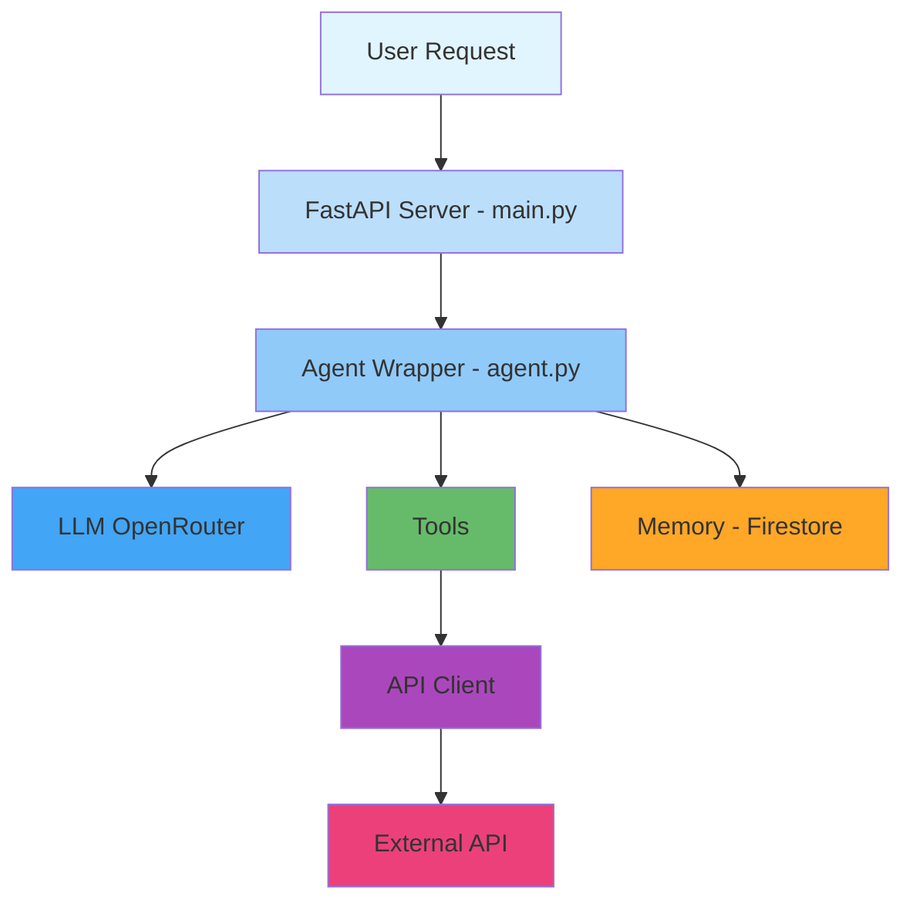
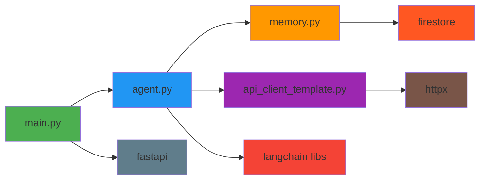
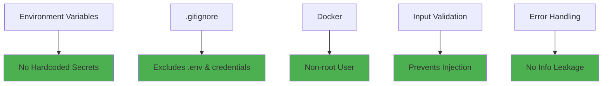

# 🎯 Agent Template - Visual Guide


## 🏗️ Architecture Overview

The agent template follows a modular architecture with clear separation of concerns:

### Core Components



## 📦 Component Breakdown

### 1. **FastAPI Server** (`main.py`)
- **Purpose**: HTTP REST API interface
- **Endpoints**: 
  - `POST /chat` - Send messages
  - `GET /sessions/{id}/history` - Get history
  - `POST /sessions/{id}/clear` - Clear history
  - `GET /health` - Health check
- **Customization**: Update title/description

### 2. **Agent Core** (`agent.py`)
- **Purpose**: Brain of the agent
- **Contains**:
  - Input validation utilities
  - Tool definitions and registration
  - LLM configuration
  - System prompt
  - Agent wrapper with conversation logic
- **Customization**: Replace example tools, update prompt

### 3. **Memory System** (`memory.py`)
- **Purpose**: Persistent conversation storage
- **Technology**: Google Cloud Firestore
- **Features**:
  - Async operations
  - Auto-cleanup (TTL, max messages)
  - Session-based storage
  - Multi-user support
- **Customization**: Usually use as-is

### 4. **API Client** (`api_client_template.py`)
- **Purpose**: Interface to external APIs
- **Pattern**: Generic HTTP client with error handling
- **Customization**: Rename and implement your API methods

### 5. **Docker** (`dockerfile`)
- **Purpose**: Containerization for deployment
- **Features**:
  - Multi-stage build (smaller image)
  - Non-root user (security)
  - Health checks
  - Production-ready
- **Customization**: Usually use as-is

### 6. **Documentation**
- **README.md**: Main setup guide
- **QUICK_START.md**: Quick reference
- **AGENT_TEMPLATE.md**: Detailed patterns
- **TEMPLATE_SUMMARY.md**: Overview

## 🔄 Request Flow

```
1. User sends message → FastAPI endpoint
2. FastAPI creates/gets agent instance
3. Agent loads chat history from Firestore
4. Agent adds user message to history
5. Agent invokes LLM with tools
6. LLM decides which tools to call
7. Tools execute (may call external APIs)
8. LLM generates response
9. Agent saves response to Firestore
10. Response returned to user
```

## 🎨 Customization Map

### 🔴 High Priority (Must Customize)

| File | What to Change |
|------|----------------|
| `agent.py` | System prompt, tools, validation |
| `api_client_template.py` | Rename file, implement API methods |
| `.env` | All environment variables |

### 🟡 Medium Priority (Should Customize)

| File | What to Change |
|------|----------------|
| `main.py` | FastAPI title and description |
| `test_agent.py` | Test queries |
| `README.md` | Agent-specific documentation |
| `requirements.txt` | Additional dependencies |

### 🟢 Low Priority (Optional)

| File | What to Change |
|------|----------------|
| `memory.py` | Usually leave as-is |
| `dockerfile` | Only if special requirements |
| `.dockerignore` | Only if adding new file types |

## 📊 File Dependency Graph



## 🚀 Quick Start Visual Guide

### Step 1: Create Agent
```bash
./create_agent.sh my_agent "My Agent Description"
```

### Step 2: Configure
```
my_agent/
├── .env ← Add your API keys
└── credentials.json ← Add GCP service account
```

### Step 3: Customize
```
agent.py
├── Update SYSTEM_PROMPT_TEXT
├── Replace example tools
└── Add validation logic
```

### Step 4: Test
```bash
python test_agent.py
uvicorn main:app --reload
```

### Step 5: Deploy
```bash
docker build -t my-agent .
docker run -p 8000:8000 my-agent
```

## 🎯 Use Cases

### Example 1: Customer Support Agent
- **Tools**: Knowledge base search, ticket creation, FAQ lookup
- **API**: Zendesk/Intercom
- **Special**: Sentiment analysis

### Example 2: Analytics Agent
- **Tools**: Query database, generate charts, export reports
- **API**: PostgreSQL/BigQuery
- **Special**: Data visualization

### Example 3: E-commerce Agent
- **Tools**: Product search, order status, recommendations
- **API**: Shopify/WooCommerce
- **Special**: Product catalog integration

## 📈 Template Features Matrix

| Feature | Included | Customizable | Production Ready |
|---------|----------|--------------|------------------|
| FastAPI Server | ✅ | ✅ | ✅ |
| LangChain Integration | ✅ | ✅ | ✅ |
| Firestore Memory | ✅ | ⚠️ | ✅ |
| Docker Support | ✅ | ⚠️ | ✅ |
| Example Tools | ✅ | 🔴 Must Replace | ❌ |
| API Client | ✅ | 🔴 Must Implement | ❌ |
| Input Validation | ✅ | ✅ | ⚠️ |
| Error Handling | ✅ | ✅ | ✅ |
| Testing Script | ✅ | ✅ | ✅ |
| Documentation | ✅ | ✅ | ✅ |

Legend:
- ✅ Complete, ready to use
- ⚠️ Good but may need adjustment
- 🔴 Placeholder, must customize
- ❌ Example only, not for production

## 🔐 Security Features



## 💡 Pro Tips

### Tip 1: Start Simple
Begin with one or two tools and test thoroughly before adding more.

### Tip 2: Use Type Hints
Type hints help catch errors early and improve IDE support.

### Tip 3: Validate Everything
Never trust user input - validate all parameters.

### Tip 4: Log Strategically
Log errors and important events, but not sensitive data.

### Tip 5: Test Locally First
Use `test_agent.py` before deploying to ensure everything works.

## 🎓 Learning Resources

1. **This Template**: Start here with example code
2. **David Agent**: See a complete, working implementation
3. **LangChain Docs**: Understand tool calling and agents
4. **FastAPI Docs**: Learn about async endpoints
5. **Firestore Docs**: Understand data persistence

## 📞 Support

- **Quick Questions**: Check `QUICK_START.md`
- **Setup Help**: See `README.md`
- **Deep Dive**: Read `AGENT_TEMPLATE.md`
- **Examples**: Study `school_analytics_agent_david`

---

**Template Version**: 1.0  
**Last Updated**: December 1, 2024  
**Total Components**: 14 files  
**Ready for**: Development, Testing, Production  

🚀 **Start building your AI agent today!**
